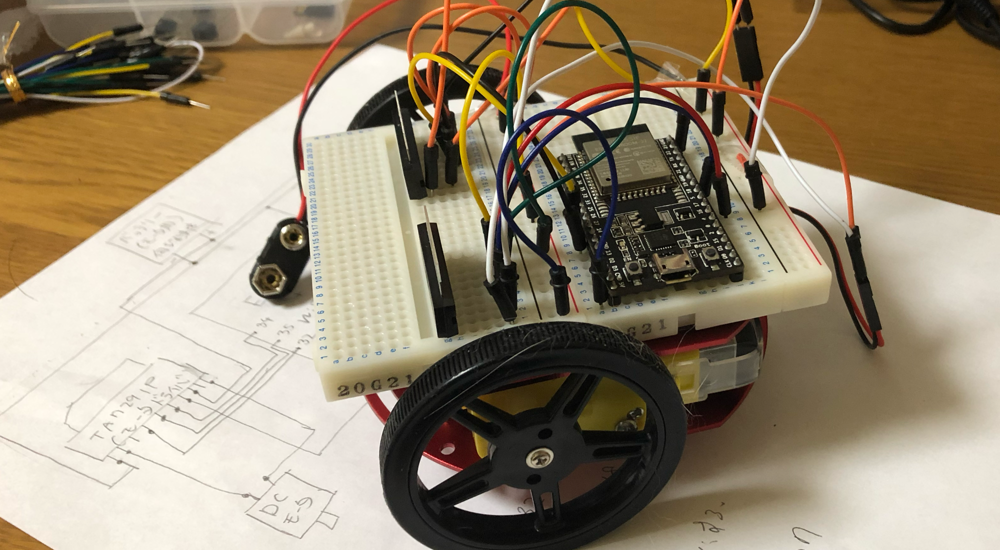

# hp_2021
## 記事を書くためのマニュアル的なもの
サークル活動の一環として行ったことについて記事を書くことは電気工学研究会の重要な活動の1つです。以下ではhtmlで記事を書くために守ってほしいルールを挙げていきます。

## articlesフォルダ下に自分の記事のフォルダを作成する。
記事はarticlesフォルダの中に入れましょう。構成の例を以下に挙げます。
- articles
  - my_article
    - img
      - my_image1.png
      - thumbnail.png
    - index.html
    
## articles.htmlのカード（記事の一覧の四角）を追加する。
articles.htmlのカードを追加します。コメントで記事一覧のdivがわかるようになっています。そこに以下のコードを追加して下さい。実際にはこのコードのコピペではなく、エディタ上ですでにあるカードの記述をコピペすれば良いと思います
```
<div class="col-sm-4" data-group="elec">
  <div class="card shadow my-3">
    <a href="./articles/radicon/index.html"></a>
    <div class="card-body">
      <a class="text-body noneunderbar" href="./articles/radicon/index.html"><p class="card-title">ESP-WROOM-32 を用いた Wi-Fi ラジコンカーの作成</p></a>
      <div class="d-flex justify-content-between align-items-center">
        <a href="./articles/radicon/index.html" type="button" class="btn btn-sm btn-outline-secondary">見る</a><small class="text-muted text-end">電子工作</small>
      </div>
    </div>
  </div>
</div>
```
このコードを改変していきます。まず自分の書いた記事が電子工作、プログラミング、ブログのどれなのかを一番初めのdivのdata-groupに記述します。
- 電子工作→elec
- プログラミング→prog
- ブログ→blog

として下さい。また上記コード7行目のsmallタグの中身もそれに合わせて変更します。

次に上記コード3,5,7行目のaタグのリンクを自分の記事のリンクに改変します。3行目のimgタグには自身の記事フォルダ内にある準備したサムネイルを指定してください。このときサムネイルとして用いる画像は縦横比が11:20となるようにお願いします。
また5行目のpタグで記事のタイトルを記述します。以上でカードの追加は完了です。

## 自分の記事を書く
自身の記事のフォルダ内にindex.htmlを用意します。そしてそれにarticles/example/index.htmlの内容を全てコピーしてください。


head内のogp設定のリンクやタイトルなども変更してください。
コピーしたコードを見ると"ここから記事を書き始めて下さい"と"記事終了部"というコメントがあります。この中身に自身の書いた記事のhtmlを記述してください。


基本的にその内部では記事は好きに構成してくださって結構です。しかし、記事タイトルと掲載した日付は入れるようにしてください。cssを自前で用意するのもいいですが、
その場合はタグを直接修飾せず、自分で作ったクラスに修飾を行ってください。ナビゲーションやフッターなどの共通部分の表記が崩れる可能性があります。


本ホームページはbootstrap5で書かれています。そのutilityやgridなどを活用するのがおすすめです。

## 完成
以上で記事は完成です。理科大のサーバに乗せてみて、ブラウザで自分の書いた記事を確認してみましょう。サーバに乗せたいときは、担当に申し出てください。またなにかわからないことがあればググるか先輩に聞いてみましょう。
